# Tworzenie klastra w Kubernetesie - debiloodporny (mam nadzieję) poradnik

## Co będzie w tym poradniku?

W tym poradniku postaram się jak dla debila przygotować instrukcje instalacji Kubernetesa na Ubuntu lub Debianie w zasadniczo dowolnej wersji, tak aby na pewno działało, wytłumaczyć co które polecenie oznacza oraz inicjacji klastra.

Wszelkie polecenia tutaj przedstawione wykonywałem na Debianie 11, część poleceń sprawdzałem też na Ubuntu 22.04 (zwykłym, nie serwerowym)

## Pre państwa, zaczynamy

### Ustawienie statycznego IP (raczej dosyć istotne)

Po zainstalowaniu systemu (Debian lub Ubuntu) warto upewnić się, że maszyna ma statyczny adres IP, żeby się na pewno nic nie wysypało.

Ja mam ustawiony w VirtualBoxie bridge w ustawieniach sieci, a mój router to MikroTik, więc mogę w nim w łatwy sposób ustawić statyczny adres IP dla maszyny.

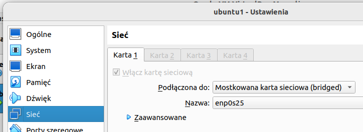

#### Ustawienie statycznego IP na Debianie

Ja właśnie tak jak napisałem wyżej zrobię u siebie, a wam podrzucę link do poradnika jak ustawić statyczny IP bezpośrednio na maszynie z Debianem\.

[How to set up static IP address on Debian Linux 10/11 - nixCraft (cyberciti.biz)](https://www.cyberciti.biz/faq/add-configure-set-up-static-ip-address-on-debianlinux/)

Powyższy poradnik jest dla wersji 11 Debiana, ale na starszych powinien również działać (wiele się nie zmieniło w tej kwestii).

#### Ustawienie statycznego IP na Ubuntu

Na Ubuntu natomiast sprawa jest prostsza.

Plik, w którym znajduje się konfiguracja sieci jest w katalogu:

```shell
/etc/netplan/
```

I plik ten jest plikiem *.yaml.

Sami musicie się zorientować, który to plik. Sprawdźcie najpierw poleceniem `ip a` jaki macie adres IP na interfejsie enpXX (po prostu zaczynającym się od enp, to jest interfejs, którym maszyna łączy się z internetem).

Potem sprawdzajcie pliki yaml, aż dojdziecie do tego, w którym jest wasz IP.

Jak już będziecie mieli ten plik, to będzie on wyglądał podobnie do tego:

```yaml
# This file describes the network interfaces available on your system
# For more information, see netplan(5).
network:
  version: 2
  renderer: networkd
  ethernets:
    enp0s3:
      dhcp4: yes
```

`dhcp4: yes` oznacza, że adres jest przydzielany przez serwer DHCP i może się on zmienić (o ile na routerze nie ustawimy go na statyczny).

Aby na maszynie adres był ustawiony na statyczny, trzeba zmienić `dhcp4: yes` na `dhcp4: false`, ale to nie wszystko.

Q: A dlaczego na `false` a nie na `no`?

A: A dlatego, że jak u siebie dałem na `no`, to przy włączonym serwerze DHCP, jak podłączyłem się przez SSH do tej maszyny, to dostała z DHCP drugi adres na ten sam interfejs (tak, jeden interfejs może mieć dwa adresy IP, ~~takie rzeczy tylko w Linuxie,~~ nie no, nie tylko w Linuxie, w Windowsie też można coś takiego podobnego zrobić xD)

Plik po zmianach powienien wyglądać mniej więcej tak:

```yaml
# This file describes the network interfaces available on your system
# For more information, see netplan(5).
network:
  version: 2
  renderer: networkd
  ethernets:
    enp0s3:
     dhcp4: false
     addresses: [192.168.1.222/24]
     gateway4: 192.168.1.1
     nameservers:
       addresses: [8.8.8.8,8.8.4.4]
```

**Na litość Boską, nie róbcie kopiuj-wklej tego pliku!!! Macie inne nazwy interfejsów sieciowych i inne adresacje IP u siebie, jak tylko skopiujecie, może wam nie zadziałać!**

Tam, gdzie jest addresses należy wpisać adres IP, który chcemy przydzielić maszynie, oraz po slashu maskę podsieci w postaci ilości bitów. Do tego możemy sprawdzić jaką mamy maskę poleceniem `ip a`. `gateway4` to brama domyślna - zazwyczaj adres naszego routera (pod warunkiem, że w VirtualBoxie ustawimy bridge).

Nameservers to są adresy DNS, to możecie skopiować żywcem i powinno zadziałać.

**JAKO ŻE TO JEST PLIK YAML, NALEŻY UWAŻAĆ NA TABULACJE, PODOBNIE JAK PRZY PISANIU W PYTHONIE!!!**

Po zedytowaniu tego wszystkiego w pliku yaml i zapisaniu go należy wykonać jedno, w chuj ważne polecenie, żeby to wszystko zadziałało.

```shell
sudo netplan apply
```

W razie, jak coś będzie nie tak, to wyjebie wam błąd ;)

### Instalacja kubeadm, kubectl, kubelet

Jeśli mamy gołego Debiana bez środowiska graficznego, to bardzo prawdopodobne jest, że nie ma na nim polecenia `sudo`

Więc warto je doinstalować:

1. Logujemy się na roota: `su` a następnie wpisujemy hasło do roota, które nadaliśmy przy instalacji Debiana
2. Wydajemy polecenie `apt update && apt install sudo`
3. Następnie trzeba dodać naszego użytkownika do grupy sudo, aby móc używać polecenia sudo: `/usr/sbin/usermod -aG sudo <nazwa_naszego_użytkownika>`
4. Wychodzimy z roota poleceniem `exit`.
5. Trzeba się wylogować i zalogować ponownie, aby załapało nową grupę i zaczęło działać polecenie sudo

Następnie robimy upgrade paczek w systemie (to raczej nie jest konieczne): `sudo apt -y full-upgrade`

Po updacie robimy restart systemu: `sudo reboot -f`

**UWAGA!** Jeśli polecenie upgrade'u wyrzuciło wam coś takiego:

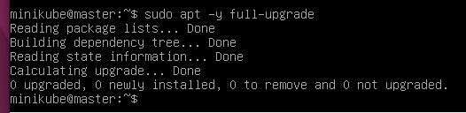

To oznacza, że nie zostały zaktualizowane żadne paczki (po prostu są w najnowszej wersji wg repozytoriów, które macie zapisane u siebie) i **NIE MA SENSU** robić restartu - tracicie tylko trochę czasu ;)

W tym miejscu warto wyłączyć maszynę i zrobić jej migawkę - w razie gdyby coś poszło nie tak, można szybko zacząć od nowa bez czekania na zainstalowanie się systemu. Zrobienie migawki w VirtualBoxie jest dość łatwe, w internecie można znaleźć jak to zrobić, więc nie będę tutaj tego opisywał.

Wykonujemy polecenia:

```shell
sudo apt -y install curl apt-transport-https gnupg
curl -s https://packages.cloud.google.com/apt/doc/apt-key.gpg | sudo apt-key add -
echo "deb https://apt.kubernetes.io/ kubernetes-xenial main" | sudo tee /etc/apt/sources.list.d/kubernetes.list
```

Powyższymi poleceniami dodaliśmy sobie do systemu repozytorium Kubernetesa, aby móc go zainstalować.

Następnie robimy `sudo apt update`, aby można było instalować paczki z tego dodanego repozytorium - ono jest dodane, ale menedżer pakietów - apt jeszcze o nim nie wie.

Jeśli pojawią się pomarańczowe warningi, można je zignorować.

Następnie instalujemy paczki potrzebne do działania Kubernetesa:

```shell
sudo apt -y install git wget kubelet kubeadm kubectl
```

Nastepnie ustawiamy utrzymywanie wersji paczek Kubernetesa, aby nam się ne aktualizowały: `sudo apt-mark hold kubelet kubeadm kubectl`

Aby sprawdzić czy na pewno dobrze zostały zainstalowane wszystkie paczki możemy wykonać polecenie:

```shell
kubectl version --client && kubeadm version
```

które powinno wyświetlić nam coś takiego:

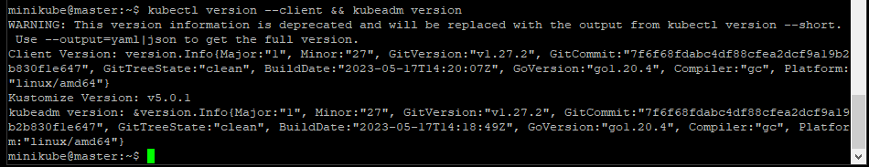

Warningiem się nie przejmujemy.

### Wyłączenie swapa (dla pewności najlepiej wykonać, nawet jeśli nie ma się swapa) oraz ustawienie bridge dla Dockera

Wykonujemy poniższe polecenie:

```shell
sudo sed -i '/ swap / s/^\(.*\)$/#\1/g' /etc/fstab
```

Otwieramy plik `/etc/fstab` i zakomentowujemy za pomocą # linijkę ze `swap`

np. `sudo nano /etc/fstab`

Jeśli tej linijki nie ma, to jej nie ma i tyle - nie ma swapa.

Ale i tak dla pewności pozostałe polecenia można wykonać:

```shell
sudo swapoff -a
sudo mount -a
free -h
```
To ostatnie polecenie wyświetla informacje o pamięci RAM, w tym o swapie

```shell
# Enable kernel modules / włącz moduły jądra (kernela)
sudo modprobe overlay
sudo modprobe br_netfilter
```

```shell
# Ustawienie bridge dla kontenerów
sudo tee /etc/sysctl.d/kubernetes.conf<<EOF
net.bridge.bridge-nf-call-ip6tables = 1
net.bridge.bridge-nf-call-iptables = 1
net.ipv4.ip_forward = 1
EOF
```

```shell
# Przeładuj sysctl
sudo sysctl --system
```

Swap wyłączony, ustawiony też bridge dla kontenerów.

### Instalacja Dockera

Na początek doinstalowujemy brakujące paczki:

```shell
sudo apt install -y gnupg2 software-properties-common
```

Pobieramy klucz GPG dla repozytorium Dockera:

```shell
curl -fsSL https://download.docker.com/linux/$(lsb_release -is | tr '[:upper:]' '[:lower:]')/gpg | sudo apt-key add -
```

To co jest w `$()` zwraca nazwę dystrybucji Linuxa - "debian" lub "ubuntu" w naszym przypadku.

Następnie dodajemy repzytorium Dockera:

```shell
sudo add-apt-repository "deb [arch=amd64] https://download.docker.com/linux/$(lsb_release -is | tr '[:upper:]' '[:lower:]') $(lsb_release -cs) stable"
```

Następnie znowu trzeba zrobić `sudo apt update`

I instalujemy paczki dla Dockera:

```shell
sudo apt install -y containerd.io docker-ce docker-ce-cli
```

Teraz musimy utworzyć jeden katalog:

```shell
sudo mkdir -p /etc/systemd/system/docker.service.d
```

Tworzymy plik demona dla Dockera:

```shell
sudo tee /etc/docker/daemon.json <<EOF
{
  "exec-opts": ["native.cgroupdriver=systemd"],
  "log-driver": "json-file",
  "log-opts": {
    "max-size": "100m"
  },
  "storage-driver": "overlay2"
}
EOF
```

I uruchamiamy i włączamy usługi:

```shell
sudo systemctl daemon-reload
sudo systemctl restart docker
sudo systemctl enable docker
```

Sprawdzamy czy Docker działa:

```shell
systemctl status docker
```

Wynik tego polecenia powinien wyglądać tak:

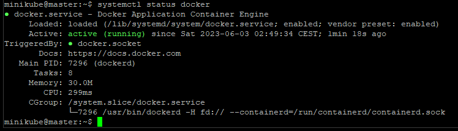

Do działania Kubernetesa na Dockerze musimy zainstalować Mirantis cri-dockerd.

Najpierw sprawdzamy jaka jest najnowsza wersja i zapisujemy tą informację do zmiennej:

```shell
VER=$(curl -s https://api.github.com/repos/Mirantis/cri-dockerd/releases/latest|grep tag_name | cut -d '"' -f 4|sed 's/v//g')
```

A potem możemy wydrukować ten numer wersji: `echo $VER`

I pobieramy tą wersję cri-dockerd

```shell
### For Intel 64-bit CPU ###
wget https://github.com/Mirantis/cri-dockerd/releases/download/v${VER}/cri-dockerd-${VER}.amd64.tgz
tar xvf cri-dockerd-${VER}.amd64.tgz

### For ARM 64-bit CPU ###
wget https://github.com/Mirantis/cri-dockerd/releases/download/v${VER}/cri-dockerd-${VER}.arm64.tgz
tar xvf cri-dockerd-${VER}.arm64.tgz
```

Należy wybrać odpowiednie dwie linijki kodu w zależności od tego na jakim procesorze działa nasza maszyna: jeśli Intel lub AMD 64-bitowy, to dwie pierwsze linijki

Jeśli 64-bitowy procesor ARM (raczej nie :P ), to ostatnie dwie linijki.

Te dwie linijki wykonujemy najlepiej osobno, najpierw pierwsza, potem druga.

Następnie przenosimy paczkę cri-dockerd:

```shell
sudo mv cri-dockerd/cri-dockerd /usr/local/bin/
```

I sprawdzamy czy poprawnie przenieśliśmy poprzez uruchomienie polecenia sprawdzania wersji cri-dockerd:

```shell
cri-dockerd --version
```

Powinno się wyświetlić:

```shell
cri-dockerd 0.3.2 (23513f4c)
```

Kolejnym krokiem jest konfiguracja socket'u i service'u cri-dockerd. Wykonujemy te cztery linijki kodu jedna po drugiej:

```shell
wget https://raw.githubusercontent.com/Mirantis/cri-dockerd/master/packaging/systemd/cri-docker.service
wget https://raw.githubusercontent.com/Mirantis/cri-dockerd/master/packaging/systemd/cri-docker.socket
sudo mv cri-docker.socket cri-docker.service /etc/systemd/system/
sudo sed -i -e 's,/usr/bin/cri-dockerd,/usr/local/bin/cri-dockerd,' /etc/systemd/system/cri-docker.service
```

I uruchamiamy socket i service cri-dockerd, aby Kubernetes mógł korzystać z Dockera jako usługi konteryzacji (wykonujemy po kolei linijki kodu):

```shell
sudo systemctl daemon-reload
sudo systemctl enable cri-docker.service
sudo systemctl enable --now cri-docker.socket
```

I sprawdzamy, czy socket działa:

```shell
systemctl status cri-docker.socket
```

Jeśli powyższe polecenie pokaże nam to:

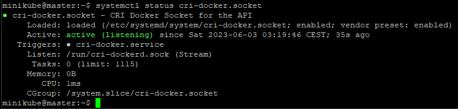

to wszystko jest ok. Ścieżka podana po Listen, to ścieżka, której musimy użyć przy inicjacji klastra Kubernetesa jako `--cri-socket-uri`

To co robiliśmy powyżej, należy zrobić na każdej maszynie, która ma być nodem w klastrze. Można teraz sklonować maszyny i zmienić nazwy hostów na tych maszynach, oraz adresy IP.

### Klonowanie maszyn w VirtualBoxie

Zanim spróbujemy sklonować maszynę wirtualną, należy ją oczywiście wyłączyć.

Można to zrobić poleceniem `sudo shutdown now`, lub zwyczajnie z poziomu okna VirtualBoxa kliknąć krzyżyk i wybrać "Wyślij sygnał wyłączenia".

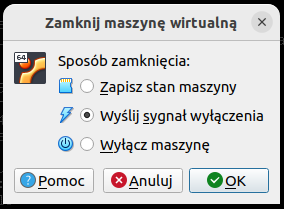

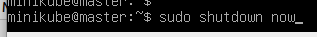

Klikamy prawym przyciskiem na maszynę na liście w VirtualBoxie i wybieramy "Sklonuj"

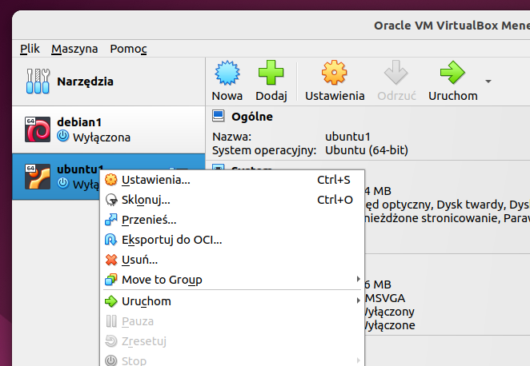

Ustawiamy nazwę nowej maszyny, ścieżkę zostawiamy bez zmian, `MAC Address Policy` ustawiamy na `Wygeneruj nowe adresy MAC...` i klikamy `Next`

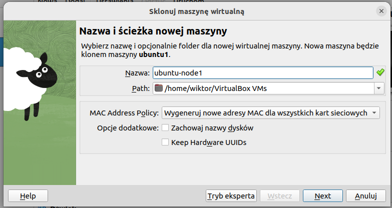

Pozostawiamy `Pełny klon` i klikamy `Zakończ`

Maszyna się klonuje, w międzyczasie możemy utworzyć jeszcze dwa klony, nie musimy czekać na skończenie klonowania.

Odpalamy maszyny i...

... jeśli ustawialiście statyczny IP na maszynach, według tego co napisałem wyżej, to musicie na każdej maszynie, oprócz mastera, zmienić IP - żeby te maszyny mogły się ze sobą komunikować. Robicie to tak samo jak tam wyżej było, z tą różnicą, że wystarczy ostatni oktet adresu zmienić i tyle.

Q: A co to ten oktet???

A: Kurwa, nie uważaliście na sieciach? xD Adres IP składa się z oktetów oddzielonych kropką, zmieniamy ostatni z nich. Oktet, ponieważ te liczby oddzielone kropkami w formie binarnej są zapisywane na ośmiu bitach.

... jeśli ustawialiście statyczny IP na routerze, to i tak warto się upewnić, że maszyna dostała inny adres IP niż master. U mnie dostają inne adresy IP, więc wystarczy że ustawię na routerze ten adres jako statyczny - wtedy już zawsze ta maszyna będzie dostawała ten sam IP, nawet po przeinstalowaniu systemu.

Jeśli też ustawialiście IP na routerze, to polecam te sklonowane maszyny odpalać po kolei, tak żeby dostawały kolejne adresy i żebyśmy mieli nad tym kontrolę, że maszyna master ma adres z końcówką np. 25, node1 ma 26, node2 ma 27, itd.

### Zmiana hostname

Po sklonowaniu wszystkie maszyny mają taką samą nazwę hosta. Musimy je zmienić, bo nie mogą być takie same w jednym klastrze.

Ja pierwszą maszynę nazwałem `master`, więc teraz wszystkie maszyny nazywają się `master`

Mastera zostawiamy więc w spokoju, odpalamy node1 i sprawdzamy jaką ma nazwę poleceniem `hostnamectl`

`Static hostname` to nasza nazwa hosta, którą musimy zmienić

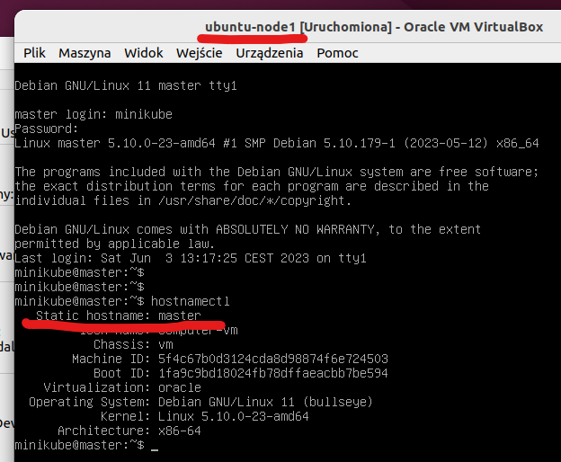

Zobaczcie, że jestem na `node1`, a nazwę mam `master`. Chcę, żeby było `node1` zamiast `master`

Wydaję polecenie:

```shell
sudo hostnamectl set-hostname node1
```

Na razie po wykonaniu polecenia nie widać zmiany. Dopiero gdy się wylogujemy, zobaczymy nową nazwę, przy logowaniu.

Ale musimy zrobić jeszcze jedno: zmienić nazwę hosta na nową w pliku `/etc/hosts`, aby nazwa `node1` była tłumaczona na adres `localhost`:

```shell
sudo nano /etc/hosts
```

I po prostu zmieniamy master na node1 i zapisujemy.

Restartujemy maszynę:

`sudo reboot -f` lub `sudo shutdown -r now`

Powtarzamy to na pozostałych nodach, oprócz mastera.

Warto teraz zrobić migawki maszyn, aby w razie czego móc wrócić do obecnego stanu.

Gdyby wam tak jak mi maszyna nie wstała jak powinna (czarny ekran i migający kursor) xD

`Maszyna -> Zresetuj`

### Inicjacja klastra Kubernetesa

To co do tej pory wykonywaliśmy, należało zrobić na każdej maszynie, która ma być jakimkolwiek nodem. Inicjację klastra natomiast robimy tylko na nodzie, który ma być masterem.

Możemy się w końcu za to zabrać.

Sprawdzamy czy moduł br_netfilter jest załadowany

```shell
lsmod | grep br_netfilter
```

Na wyjściu powinniśmy zobaczyć coś takiego:

```shell
br_netfilter           22256  0 
bridge                151336  2 br_netfilter,ebtable_broute
```

Włączamy usługę kubelet

```shell
sudo systemctl enable kubelet
```

Umieszczamy obrazy kontenerów:

```shell
sudo kubeadm config images pull --cri-socket unix:///run/cri-dockerd.sock
```

I inicjujemy klaster Kubernetesa:

```shell
sudo kubeadm init  --cri-socket unix:///run/cri-dockerd.sock  --pod-network-cidr=172.16.0.0/16
```

Adres IP w powyższej komendzie należy zmienić, jeśli ten, który tu jest, jest już użyty w waszej sieci do zaadresowania maszyn - tzn. jeśli macie adresy z sieci 172.16.0.0 maska 16 bitów, to musicie wybrać inny adres do wpisania w tym poleceniu.

Jeśli macie mniej niż 2 CPU i 2GB RAMu przydzielone do maszyny, to trzeba zmodyfikować polecenie, dodając jeszcze jedną opcję:

```shell
sudo kubeadm init  --cri-socket unix:///run/cri-dockerd.sock  --pod-network-cidr=172.16.0.0/16 --ignore-preflight-errors=NumCPU,Mem
```

Jeśli wszystko poszło dobrze, powinniśmy zobaczyć coś takiego:

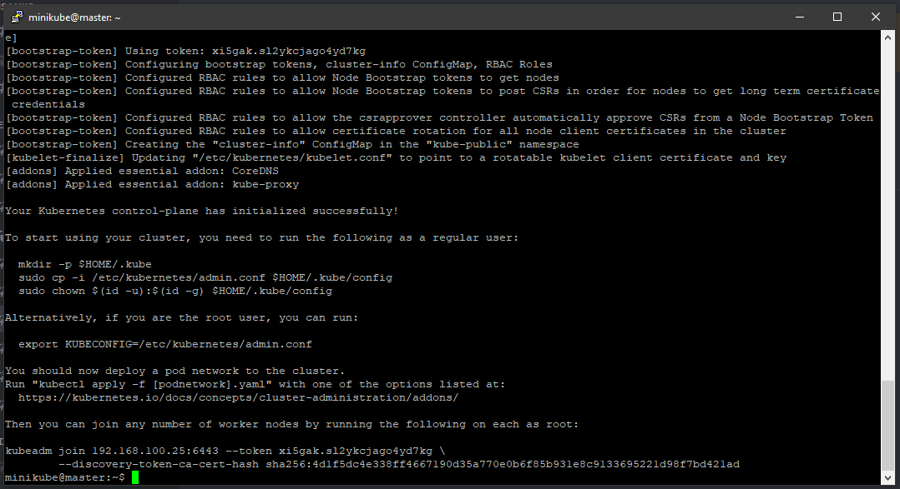

Możemy skopiować komendę dołączenia node'a do klastra, która się wyświetliła na samym końcu, albo w każdej chwili odpalić na masterze komendę

```shell
kubeadm token create --print-join-command
```

Teraz jak zostało napisane, musimy wykonać trzy polecenia jako zwykły użytkownik systemu (czyli nie root):

```shell
mkdir -p $HOME/.kube
sudo cp -i /etc/kubernetes/admin.conf $HOME/.kube/config
sudo chown $(id -u):$(id -g) $HOME/.kube/config
```

A następnie "wdrożyć" sieć pod'ów do klastra.

```shell
kubectl create -f https://raw.githubusercontent.com/projectcalico/calico/v3.25.0/manifests/tigera-operator.yaml
curl https://raw.githubusercontent.com/projectcalico/calico/v3.25.0/manifests/custom-resources.yaml -O
```

W tym pobranym pliku trzeba zmienić adres IP w spec.calicoNetwork.ipPools.cidr na ten, który daliśmy przy inicjacji klastra

```shell
kubectl create -f custom-resources.yaml
```

Możemy sprawdzić czy master node pracuje:

```shell
kubectl get nodes -o wide
```

Teraz możemy dołączyć kolejne node'y do klastra poleceniem, które wydrukowało nam się na końcu inicjacji klastra, albo, które wyświetliliśmy sobie jeszcze raz na masterze poleceniem:

```shell
kubeadm token create --print-join-command
```

To polecenie wygląda podobnie do poniższego:

```shell
kubeadm join 192.168.100.25:6443 --token qbateg.5uffinrwny1ghn3r --discovery-token-ca-cert-hash sha256:4d1f5dc4e338ff4667190d35a770e0b6f85b931e8c9133695221d98f7bd421ad
```

Należy pamiętać aby wykonać je jako root, czyli trzeba napisać `sudo` na początku. Trzeba także dopisać --cri-socket unix:///run/cri-dockerd.sock

Polecenie wynikowe wygląda mniej więcej tak:

```shell
sudo kubeadm join 192.168.100.25:6443 --token qbateg.5uffinrwny1ghn3r --discovery-token-ca-cert-hash sha256:4d1f5dc4e338ff4667190d35a770e0b6f85b931e8c9133695221d98f7bd421ad --cri-socket unix:///run/cri-dockerd.sock
```

Jeśli uda się dołączyć node do klastra, to zobaczymy na ekranie taki wynik:

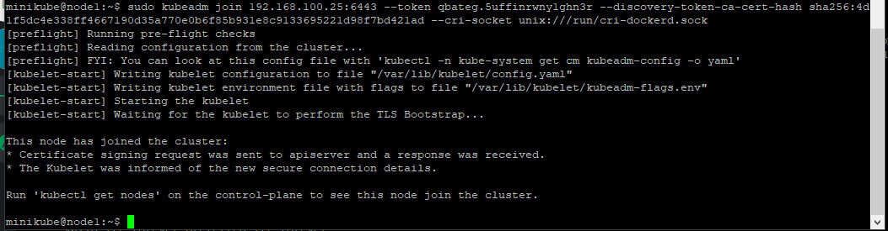

I wówczas na masterze możemy sprawdzić, czy ten node jest widoczny:

```shell
kubectl get nodes
```

Jeśli polecenie kubectl get pods --all-namespaces zwróciło wam taki wynik:

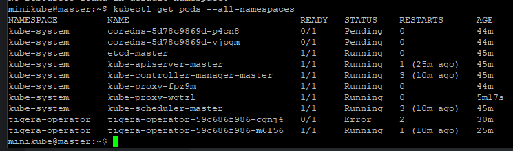

co oznacza, że nie wszystkie pody się uruchomiły, to prawdopodobnie brakuje na nodach zasobów: RAMu albo CPU. Trzeba w VirtualBoxie dać więcej zasobów, aby zadziałało.

Po dołożeniu zasobów w VirtualBoxie pody coredns nadal się nie uruchomiły, przy instalacji helma i nextclouda zobaczymy, czy to ma znaczenie.
