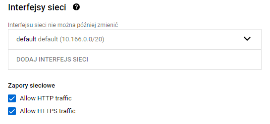
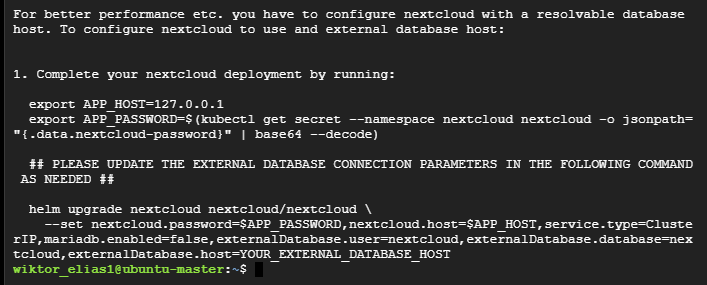
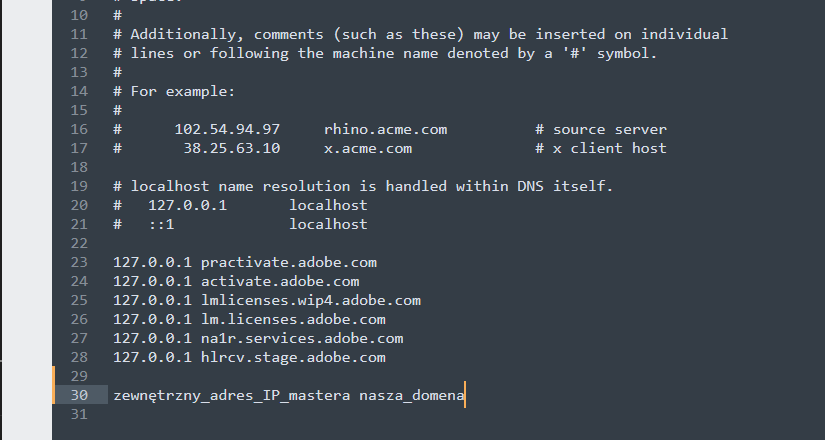
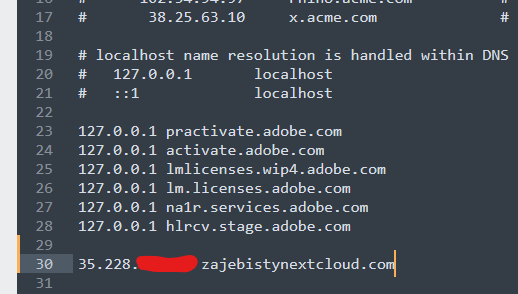
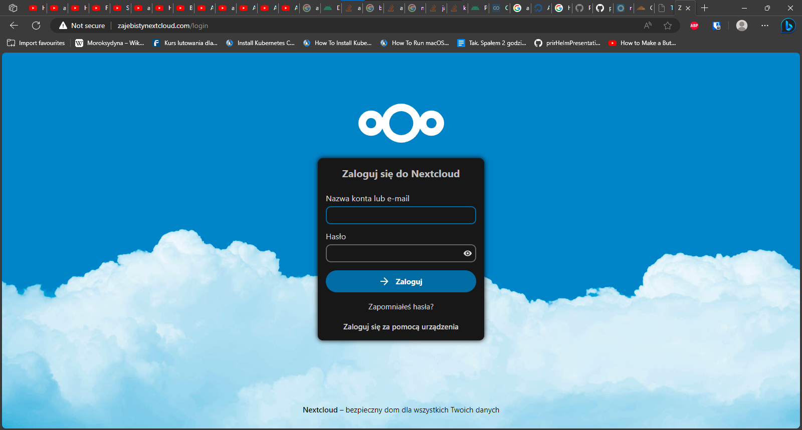
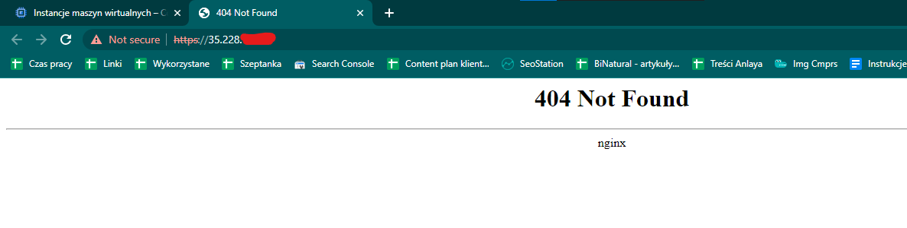

# Poradnik dotyczący instalacji Helm'a, Ingress'a i Nextcloud'a na klastrze Kubernetes'a'

**Ten poradnik można zastosować do klastrów postawionych na maszynach wirtualnych na komputerze domowym lub na maszynach Google Cloud, w pliku hosts w Windowsie podajemy wtedy odpowiedni adres IP. Będzie to zaznaczone w odpowiednim momencie poradnika.*

**Ten poradnik, tak jak poprzedni, dotyczący stawiania klastra Kubernetes'a, powienien działać na Ubuntu i Debianie, niezależnie od wersji.*

### Konfiguracja mastera na Google Cloud

*Informacja dla osób korzystających z instancji Google Cloud jako maszyn wirtualnych:*
Przed przystąpieniem do pracy należy sprawdzić konfigurację maszyny wirtualnej mastera na Google Cloud.

Musimy zezwolić na dobijanie się do niej przez http.



Wystarczy na masterze, bo to do niego będziemy się dobijać z zewnątrz, pozostałe node'y komunikują się między sobą przez sieć wewnętrzną, a tam wszystkie porty są otwarte.

I dobrze, żeby master miał też statyczny zewnętrzny adres IP, żeby bez problemu się do Nextclouda dobijać - tutaj prawdopobieństwo otrzymania innego adresu IP po wyłączeniu maszyny jest większe niż w przypadku adresów wewnętrznych.

***Poniższe działania wykonujemy TYLKO I WYŁĄCZNIE na masterze***

### Instalacja Helm'a

##### Dodawanie klucza dla repozytorium Helm'a

```shell
curl https://baltocdn.com/helm/signing.asc | gpg --dearmor | sudo tee /usr/share/keyrings/helm.gpg > /dev/null
```

##### Dodawanie repozytorium Helm'a

```shell
echo "deb [arch=$(dpkg --print-architecture) signed-by=/usr/share/keyrings/helm.gpg] https://baltocdn.com/helm/stable/debian/ all main" | sudo tee /etc/apt/sources.list.d/helm-stable-debian.list
```

##### Aktualizowanie repozytoriów

```shell
sudo apt update
```

##### Właściwa instalacja Helm'a

```shell
sudo apt install helm
```

### Instalacja Ingress'a

##### Dodawanie repozytorium Ingress'a

```shell
helm repo add ingress-nginx https://kubernetes.github.io/ingress-nginx
```

##### Aktualizowanie repozytoriów Helm'a

```shell
helm repo update
```

##### Tworzenie pliku values (*values.ingress-nginx.yml*)

```shell
nano values.ingress-nginx.yml
```

Wklejamy poniższą zawartość podmieniając `AdresIP`

```yml
controller:
  service:
    externalIPs:
      - <AdresIP>
```

Gdzie `AdresIP` to wewnętrzny adres IP mastera

##### Wdrażanie Chart'a Ingress'a

```shell
helm upgrade --install ingress-nginx ingress-nginx/ingress-nginx -f values.ingress-nginx.yml --namespace ingress-nginx --create-namespace
```

*Jeśli wyskoczy `Release "ingress-nginx" does not exist. Installing it now.` To wszystko jest OK. To oznacza, że nie ma czegoś takiego jak ingress-nginx i będzie instalowane.*
Ten komunkat się pojawia dlatego że wykonujemy polecenie `helm upgrade` z opcją `--install` zamiast polecenia `helm install`

**WAŻNE:** *Poczkaj aż pod controller zacznie działać. W przeciwnym wypadku Nextcloud może jebnąć trochę błędów xD*

### Instalacja Nextcloud'a

##### Dodawanie repozytorium

```shell
helm repo add nextcloud https://nextcloud.github.io/helm/
```

##### Aktualizowanie repozytoriów Helm'a

```shell
helm repo update
```

##### Tworzenie pliku values (*values.nextcloud.yml*)

```shell
nano values.nextcloud.yml
```

I wklejamy to co poniżej, zmieniamy `NazwaDomeny` wg tego, co napisałem niżej, pod treścią pliku.

```yml
nextcloud:
  host: <NazwaDomeny>

cronjob:
  enabled: true

ingress:
  enabled: true
  className: nginx
  annotations:
    nginx.ingress.kubernetes.io/proxy-body-size: 4G
    nginx.ingress.kubernetes.io/server-snippet: |-
      server_tokens off;
      proxy_hide_header X-Powered-By;
      rewrite ^/.well-known/webfinger /index.php/.well-known/webfinger last;
      rewrite ^/.well-known/nodeinfo /index.php/.well-known/nodeinfo last;
      rewrite ^/.well-known/host-meta /public.php?service=host-meta last;
      rewrite ^/.well-known/host-meta.json /public.php?service=host-meta-json;
      location = /.well-known/carddav {
        return 301 $scheme://$host/remote.php/dav;
      }
      location = /.well-known/caldav {
        return 301 $scheme://$host/remote.php/dav;
      }
      location = /robots.txt {
        allow all;
        log_not_found off;
        access_log off;
      }
      location ~ ^/(?:build|tests|config|lib|3rdparty|templates|data)/ {
        deny all;
      }
      location ~ ^/(?:autotest|occ|issue|indie|db_|console) {
        deny all;
      }
  labels: {}
  path: /
  pathType: Prefix
```

Gdzie `NazwaDomeny` to nazwa domenowa, którą możemy sobie wymyślić lub wybrać taką, którą zarejestrowaliśmy sobie np. na nazwa.pl.

Jeśli wybieramy domenę wykupioną na nazwa.pl lub u innego rejestratora domen, należy ustawić przekierowanie tej domeny na zewnętrzny adres IP naszego mastera.

Jeśli wybierzemy pierwszą opcję - musimy dodać do pliku hosts w Windowsie adres IP zewnętrzny mastera i przypisać do niego naszą wymysloną domenę.

**To jest krok ważny w chuj, ponieważ nextcloud nie otworzy nam się gdy wpiszemy po prostu adres IP.**

Tak zwyczajnie działają strony www, może być kilka stron na jednym serwerze z takim samym IP - skąd serwer www ma wiedzieć jaką stronę chcemy otworzyć? Z informacji na jaką domenę się dobijamy. Nextcloud nie pozwala zamiast nazwy domenowej wpisać adresu IP, więc musimy się bawić trochę XD

##### Wdrażanie chart'a Nextcloud'a

```shell
helm upgrade --install nextcloud nextcloud/nextcloud -f values.nextcloud.yml --namespace nextcloud --create-namespace
```

Gdy zobaczymy to:

to zajebiście :P

##### Końcowa konfiguracja Nextcloud'a

Teraz żeby dokończyć konfigurację Nextclouda musimy zrobić kilka rzeczy:

Mamy napisane zresztą, żetrzeba wykonać dwa exporty: `APP_HOST` i `APP_PASSWORD`

Nas najbardziej interesuje `APP_HOST`, ponieważ od tego czy dobrze go zrobimy zależy czy zadziała nam w ogóle ten Nextcloud.

Wykonujemy więc

```shell
export APP_HOST=<IPmastera>
```

Zamiast `IPmastera` podajemy to samo IP, które wpisywaliśmy przed instalacją Ingress'a

A następnie wykonujemy drugi export:

```shell
export APP_PASSWORD=$(kubectl get secret --namespace nextcloud nextcloud -o jsonpath="{.data.nextcloud-password}" | base64 --decode)
```

To nawet możecie skopiować stąd, bo w tym poleceniu nic nie zmieniamy i ono u każdego wygląda tak samo.

(Mi wyjebało maszynki, gdy kopiowałem to polecenie żeby je wkleić do poradnika xD)
I oczywiście z 3 na 4 wyjebane maszyny, musiał się tam znaleźć master, nosz kurwa mać XD

Dobra, lecimy dalej

##### Konfiguracja pliku hosts w Windowsie

aby się dostać do Nextcloud'a.

Teraz żeby się dobić do tego naszego Nextcloud'a musimy zrobić coś, aby nasza przeglądarka wiedziała dokąd ma wysłać zapytanie, czyli na jaki adres IP ma je wysłać.

Nasza wymyślona wcześniej domena nie istnieje w internecie. Prawdopodobnie nie uda się nam też jej zarejestrować. Musimy zrobić coś innego.

W systemach operacyjnych istnieje coś takiego jak plik hosts. Jest to nic innego jak plik ze statyczną informacją o tym jaki adres IP odpowiada konkretnej nazwie domenowej.

To taki wewnętrzny DNS, który działa tylko na tym jednym konkretnym komputerze. Jeśli w nim jest wpis jakiejś domeny, to przy próbie pingowania jej albo otwarcia w przeglądarce komputer w ogóle nie pyta serwera DNS o adres IP dla tej domeny, tylko odczytuje ją z tego pliku i od razu wysyła tam zapytanie albo pakiet.

Q: No dobra, ja tu przyszedłem po to, żeby się dowiedzieć ja kto zrobić, a nie słuchać tych twoich pierdololo co jest czym i z czym się łączy!

A: Pan(i) \<Tu wstaw swoje imię i nazwisko\>
    Ok.
    RockingBasket, Elbląg.

Otwieramy dowolny edytor tekstu **JAKO ADMINISTRATOR, POGRUBIAM TO W CHUJ, ŻEBYM POTEM KURWA NIE DOSTAŁ WIADOMOŚCI "a mi nie działaaaaa, nie chce się zapisaaaać"**

W tak otwartym edytorze, **JAKO ADMINISTRATOR**, otwieramy plik:
`C:\Windows\system32\drivers\etc\hosts`

Na jego końcu dopisujemy:



Czyli w moim przypadku:



W przypadku korzystania z Google Cloud publiczny (I mean zewnętrzny xD) IP maszyny można sprawdzić tutaj:
[https://console.cloud.google.com/compute/instances](https://console.cloud.google.com/compute/instances)

W przypadku, gdy klaster mamy postawiony na komputerze w domu, na maszynach wirtualnych (albo i fizycznych xD) musimy się zastanowić nad jedną rzeczą:

1. Czy będziemy wchoodzić na Nextcloud'a tylko w domu (lub przez tunel VPN do sieci domowej), czy też z zewnątrz, z internetu.
2. Jeśli będziemy wchodzić z zewnątrz, to jaki w domu mamy internet - konkretnie, czy dostajemy na routerze publiczny adres IP, czy prywatny. Jeśli mamy internet LTE albo 5G, to na 99% adres na routerze jest prywatny.

Jeśli będziemy wchodzić z domu lub przez VPN, to w pliku hosts zamiast zewnętrznego adresu mastera wpisujemy adres wewnętrzny.

Jeśli natomiast będziemy wchodzić z zewnątrz, to podajemy adres IP routera, którym "wychodzimy na świat". Można go sprawdzić na [https://twojeip.wp.pl](https://twojeip.wp.pl). A na routerze należy przekierować odpowiedni port na maszynę mastera. Można przekierować port inny niż 80 (i najlepiej tak zrobić ze względów bezpieczeństwa - odblokowanie portu 80 nie jest najlepszym pomysłem, jeśli nie jest bardzo konieczne),
**ALE W CHUJ WAŻNE JEST, ŻEBY PRZEKIEROWAĆ TEN PORT NA PORT 80 MASTERA, bo na tym porcie nasłuchuje na masterze serwer www Nextcloud'a.**

Jeśli mamy internet LTE, to na 99% mamy na routerze prywatny, zmienny adres IP, i nie uda nam się wystawić Nextcloud'a na świat w standardowy sposób, czyli przez przekierowanie portów. No, chyba, że możemy u operatora wykupić publiczny IP, to wtedy problemu w sumie nie ma wielkiego.

### Sprawdzenie czy Nextcloud działa

Działa!!!



No dobra, dobra, już się nie czepiajcie, że tyle kart mam otwartych, piszę apkę na Androida, ok? xD

Domyślne dane logowania do Nextclouda to:

```
login: admin
hasło: changeme
```

Mam nadzieję, że wam też działa :\)

A to się stanie, gdy będziemy próbowali wejść przez adres IP zamiast domeny:


